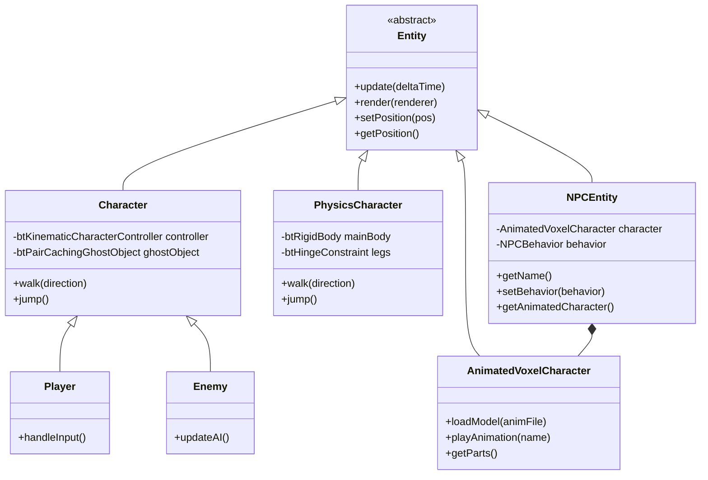

# Entity System Architecture

## Overview

The Entity System provides a framework for dynamic game objects that exist within the world but are distinct from the voxel terrain. This includes the player character, enemies, and potentially other interactive objects.

## Class Hierarchy

The system is built on a standard inheritance hierarchy:



### Entity
The base abstract class defining the interface for all game objects.
- **Responsibilities**: Lifecycle management (update/render), transform access.
- **Key Methods**: `update()`, `render()`.

### PhysicsCharacter (DEPRECATED — Bullet removed)
> **No longer in active builds.** `PhysicsCharacter` (and `Character`, `SpiderCharacter`,
> `VoxelCharacter`, `PhysicsDriveMode`) were moved to `engine/deprecated/bullet/` when Bullet
> Physics was removed. The active character is `AnimatedVoxelCharacter` (kinematic capsule;
> grounds against `VoxelDynamicsWorld` occupancy grids). The Bullet-based descriptions below
> are historical. See [PhysicsCharacter.md](PhysicsCharacter.md).

A (deprecated) active-ragdoll based character controller.
- **Physics**: Used `btRigidBody` and `btHingeConstraint` with motors.
- **Balance**: Used a PID controller to maintain upright orientation.

### Character (Legacy — DEPRECATED, Bullet removed)
A specialization of `Entity` that used Bullet Physics for movement (archived in `engine/deprecated/bullet/`).
- **Physics Integration**: Uses `btKinematicCharacterController` for robust character movement (handling slopes, stairs, gravity) without the instability of pure rigid bodies.
- **Collision**: Uses `btPairCachingGhostObject` to detect collisions without applying forces to static geometry in a way that would cause jitter.
- **Rendering**: Renders as a voxel-style cube using a dedicated pipeline.

### Player
Represents the user-controlled character.
- **Input**: Polls `InputManager` for WASD and Space keys.
- **Camera**: Currently, the camera follows the player (or the player follows the camera's forward vector).

### Enemy
Represents AI-controlled characters.
- **AI**: Implements basic "chase" behavior, moving towards the player if within a certain range.

### AnimatedVoxelCharacter
A voxel character loaded from `.anim` files with a skeleton, box-based geometry, and named animation clips.
- **Model**: Bones + box geometry defined in `.anim` files. Available models in `resources/animated_characters/`.
- **Rendering**: Parts are collected by `RenderCoordinator::renderEntities()` into the instanced character batch.
- **Animations**: Named clips (idle, walk, run, jump, attack, etc.) driven by bone channel keyframes.

### NPCEntity
A non-player character that wraps an `AnimatedVoxelCharacter` and delegates logic to a pluggable `NPCBehavior`.
- **Ownership**: Owned by `NPCManager`, registered in `EntityRegistry` with type tag `"npc"`.
- **Behaviors**: `IdleBehavior` (stationary), `PatrolBehavior` (waypoint patrol with configurable speed/wait time, includes `PerceptionComponent` for FOV/LOS detection and look-around sweep at waypoints), `BehaviorTreeBehavior` (composable behavior tree with perception, blackboard, utility scoring), `WanderBehavior` (random movement).
- **Rendering**: `RenderCoordinator` pulls the inner `AnimatedVoxelCharacter*` via `getAnimatedCharacter()` and renders it alongside regular entities in the instanced batch.
- **Dialogue**: Supports an attached `DialogueProvider` for NPC conversations.
- **Lights**: Optional attached point light via `setAttachedLightId()`.

### NPCManager
Owns and manages all `NPCEntity` instances.
- **Spawning**: `spawnNPC()` / `spawnNPCWithBehavior()` — creates the entity, registers it in `EntityRegistry`, wires context.
- **Rendering integration**: `RenderCoordinator` holds a pointer to `NPCManager` (set via `setNPCManager()`). During `renderEntities()`, all NPC characters are added to the instanced render batch.
- **API**: Exposed via HTTP endpoints — `POST /api/npc/spawn`, `POST /api/npc/remove`, `GET /api/npcs`, `POST /api/npc/behavior`.

## Physics Integration

> **Bullet has been removed.** The active `AnimatedVoxelCharacter` is a kinematic capsule
> that grounds against `VoxelDynamicsWorld` occupancy grids (see
> [DynamicVoxelPhysics.md](DynamicVoxelPhysics.md) and [AgentContext.md](AgentContext.md)).
> `PhysicsWorld` is now a thin wrapper over the custom CPU `VoxelDynamicsWorld`. The
> Bullet-based descriptions below are historical (archived in `engine/deprecated/bullet/`).

### Kinematic (Legacy — Bullet, deprecated)
- **Kinematic Controllers**: Characters were kinematic objects whose movement is determined by game logic (velocity) rather than forces/impulses, colliding with the static world.
- **Lifecycle**: Bullet `PhysicsWorld` managed `btKinematicCharacterController`, `btPairCachingGhostObject`, `btConvexShape`.

### Active Ragdoll (Legacy — Bullet, deprecated)
- **Rigid Bodies**: `PhysicsCharacter` used `btRigidBody` objects with mass and inertia.
- **Constraints**: Used `btHingeConstraint` to connect body parts.
- **Motors**: Movement was driven by motors on the constraints, not by setting velocity directly.


## Rendering Pipeline

Entities are rendered using a dedicated `CharacterRenderPipeline`:
- **Shaders**: `shaders/character.vert` and `shaders/character.frag`.
- **Technique**: 
  - Uses **Push Constants** to pass Model-View-Projection matrices and Color to the shader.
  - Geometry is generated directly in the vertex shader (cube vertices), avoiding the need for vertex buffers for simple shapes.
- **Integration**: `RenderCoordinator::renderEntities` iterates through active entities and issues draw calls.

## Usage

### Spawning Entities
Entities are typically created in `Application.cpp` or `WorldInitializer.cpp`:

```cpp
// Create Player
auto player = std::make_unique<Scene::Player>(physicsWorld.get(), inputManager.get(), spawnPos);
entities.push_back(std::move(player));

// Create Enemy
auto enemy = std::make_unique<Scene::Enemy>(physicsWorld.get(), targetPlayer, spawnPos);
entities.push_back(std::move(enemy));
```

### The Update Loop
1. `Application::update()` calls `entity->update(dt)`.
2. `Player::update()` reads input and calls `walk()`.
3. `Character::walk()` sets the velocity on the physics controller.
4. `PhysicsWorld::stepSimulation()` updates the physics world.
5. `Character` syncs its internal position from the physics object.

### The Render Loop
1. `RenderCoordinator::renderEntities()` binds the character pipeline.
2. Iterates over the `entities` vector, collecting `AnimatedVoxelCharacter*` instances into an instanced batch.
3. Also iterates all NPCs from `NPCManager`, adding their inner `AnimatedVoxelCharacter*` to the same batch.
4. Renders all instanced characters together via the character instanced pipeline.

Note: `AnimatedVoxelCharacter::render()` itself is a no-op — rendering is handled entirely by `RenderCoordinator` collecting the character's `parts` directly.
