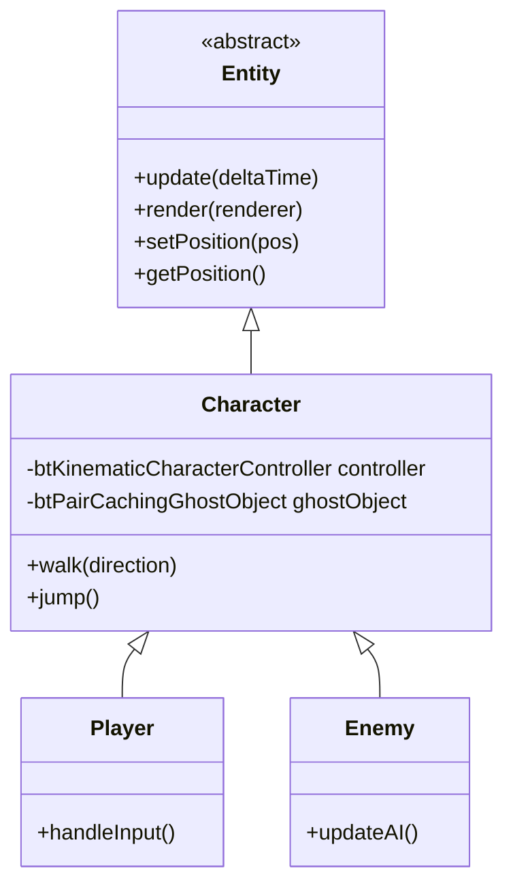

# Entity System Architecture

## Overview

The Entity System provides a framework for dynamic game objects that exist within the world but are distinct from the voxel terrain. This includes the player character, enemies, and potentially other interactive objects.

## Class Hierarchy

The system is built on a standard inheritance hierarchy:



### Entity
The base abstract class defining the interface for all game objects.
- **Responsibilities**: Lifecycle management (update/render), transform access.
- **Key Methods**: `update()`, `render()`.

### Character
A specialization of `Entity` that uses Bullet Physics for movement.
- **Physics Integration**: Uses `btKinematicCharacterController` for robust character movement (handling slopes, stairs, gravity) without the instability of pure rigid bodies.
- **Collision**: Uses `btPairCachingGhostObject` to detect collisions without applying forces to static geometry in a way that would cause jitter.
- **Rendering**: Renders as a voxel-style cube using a dedicated pipeline.

### Player
Represents the user-controlled character.
- **Input**: Polls `InputManager` for WASD and Space keys.
- **Camera**: Currently, the camera follows the player (or the player follows the camera's forward vector).

### Enemy
Represents AI-controlled characters.
- **AI**: Implements basic "chase" behavior, moving towards the player if within a certain range.

## Physics Integration

The system integrates with Bullet3 via `PhysicsWorld`:
- **Kinematic Controllers**: Characters are kinematic objects, meaning their movement is determined by game logic (velocity) rather than forces/impulses, but they still collide with the static world.
- **Lifecycle**: `PhysicsWorld` manages the creation and destruction of Bullet objects (`btKinematicCharacterController`, `btPairCachingGhostObject`, `btConvexShape`).

## Rendering Pipeline

Entities are rendered using a dedicated `CharacterRenderPipeline`:
- **Shaders**: `shaders/character.vert` and `shaders/character.frag`.
- **Technique**: 
  - Uses **Push Constants** to pass Model-View-Projection matrices and Color to the shader.
  - Geometry is generated directly in the vertex shader (cube vertices), avoiding the need for vertex buffers for simple shapes.
- **Integration**: `RenderCoordinator::renderEntities` iterates through active entities and issues draw calls.

## Usage

### Spawning Entities
Entities are typically created in `Application.cpp` or `WorldInitializer.cpp`:

```cpp
// Create Player
auto player = std::make_unique<Scene::Player>(physicsWorld.get(), inputManager.get(), spawnPos);
entities.push_back(std::move(player));

// Create Enemy
auto enemy = std::make_unique<Scene::Enemy>(physicsWorld.get(), targetPlayer, spawnPos);
entities.push_back(std::move(enemy));
```

### The Update Loop
1. `Application::update()` calls `entity->update(dt)`.
2. `Player::update()` reads input and calls `walk()`.
3. `Character::walk()` sets the velocity on the physics controller.
4. `PhysicsWorld::stepSimulation()` updates the physics world.
5. `Character` syncs its internal position from the physics object.

### The Render Loop
1. `RenderCoordinator::renderEntities()` binds the character pipeline.
2. Iterates over entities.
3. Pushes MVP matrix and Color via Push Constants.
4. Draws 36 vertices (12 triangles) for the cube mesh.
